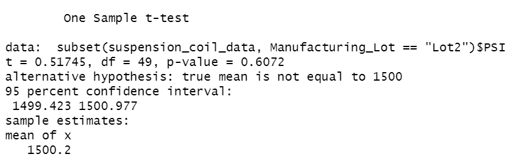

# MechaCar Statistical Analysis
 
## Linear Regression to Predict MPG

### Linear Regression Output

A linear regression was completed in R Studio. The output is below:

From this output we can see that:

- Vehicle weight, spoiler angle, and AWD contribute to random variance (P > 0.1)
- Vehicle length, ground clearance contributed significantly to non-random variance (P < 0.05)
- Vehicle weight contributed to non-random variance, but to a less significant degree (0.5 < P < 0.1)

- The slope of the linear model is not considered to be zero. The P-Value is 5.4E-11, indicating strong correlation between the coefficients and MPG

- The model does not effectively predict MPG of prototypes. While there is a correlation between vehicle length, ground clearance and MPG, there is still too much random variation to consider the model to be predictive with much confidence, as seen with the above moderate R-squared and adjusted R-squared.

## Summary Statistics on Suspension Coils

The statistical summaries for the dataset, and for each lot included in the dataset are below.

### Total Summary

### Lot Summary

It was found that some lots have a higher degree of variance than others.

Lots One and Two meet the manufacturing criteria for a variance of less than 100 PSI. This criteria is met with the full dataset as well.

Lot 3 fails to meet this criteria, with a variance of 170 PSI. 

While Lot 3 fails to meet this criteria, the overall population does meet it because of the larger sample size diluting the impact of wider variation in PSI observed in the one lot.

## T-Tests on Suspension Coils 

The following T-Test summaries show:
- The samples from all lots do not have the same mean as the population (P-Value = 0.6) with a 95% confidence interval. They would be considered the same if the confidence interval was 94% or lower.
- Lot One does not have the same mean as the population (P-Value = 1)
- Lot Two does not have the same mean as the population (P-Value = 0.6)
- Lot Three does have the same mean as the population (P-Value = 0.04), likely because it had the widest standard deviation of all lots, seen with a relatively large t (t=-2.1)

The results of the t-test is swayed by the standard deviation of the sample data sets. The t values were large for the overall population and for Lot 3. Although Lot 3 had a wider than acceptable variance, it was the only sample to have a mean considered equal to 1500 PSI within a 95% confidence interval.

### All Lots

### Lot One

### Lot Two

### Lot Three

## Study Design: MechaCar vs Competition

A statistical study could be undertaken to compare MechaCar against competitive brands by analyzing the MechaCar safety ratings for all models against the average safety rating for other manufacturers.

The null hypothesis is that there is no difference in the average safety ratings for MechaCar and other manufacturers. The alternative hypothesis is that there is a difference in the mean safety rating.

A T-Test could be used to test the hypothesis, as it is used to determine if the means of a population and a sample are the same.

A list of safety ratings, vehicle models, and manufacturers would be required to do the analysis. This assumes all ratings are tested on the same scale, and no further analysis would be required. Additional metadata could include the vehicle class, cost, and other descriptors to offer further or more specific analysis.
